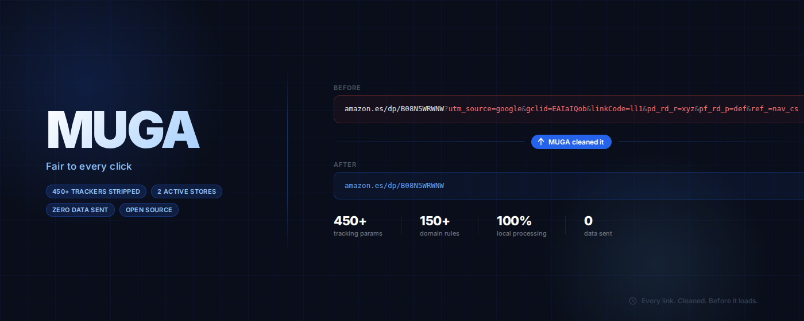
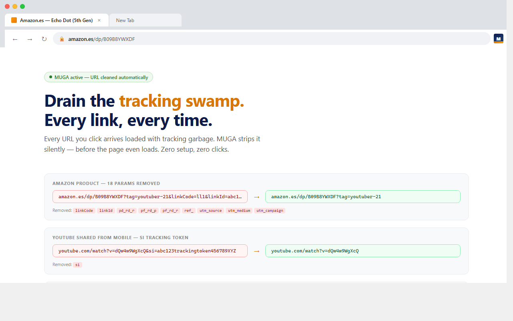
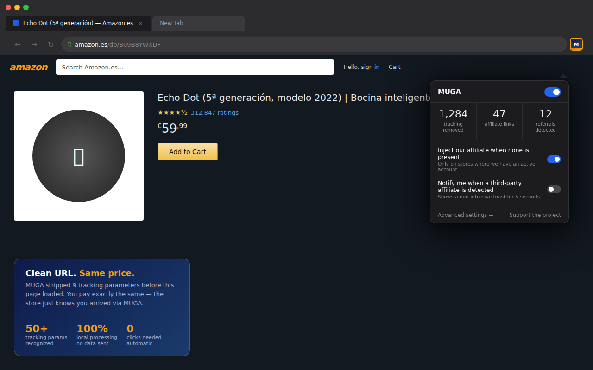
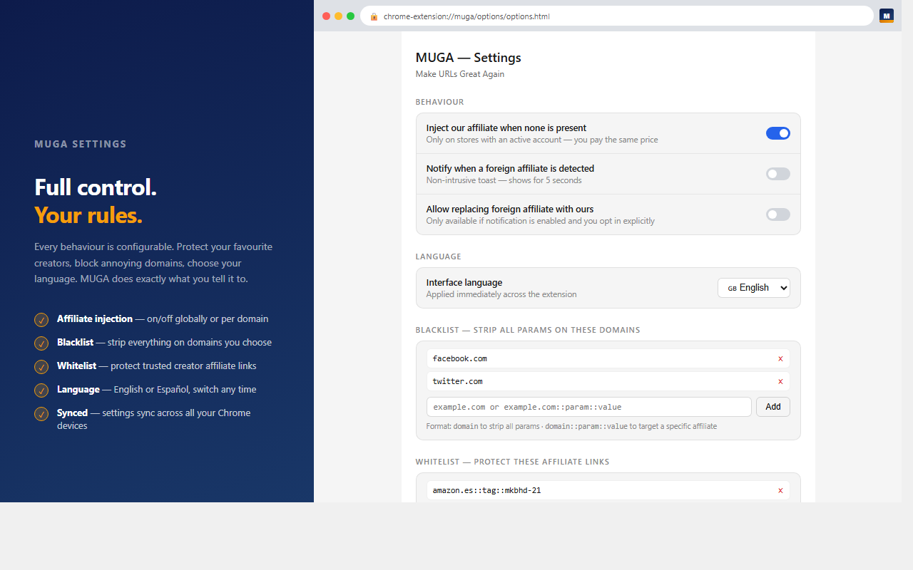

<div align="center">



[](LICENSE)
[](#)
[](#development)
[](https://github.com/yocreoquesi/muga/actions/workflows/health-check.yml)
# Every link. Cleaned. Before it loads.

URLs arrive pre-loaded with `utm_source`, `fbclid`, `gclid`, Amazon noise, YouTube share tokens, and 420+ more. MUGA strips them — automatically, before the page renders. **Zero clicks. Zero configuration. Never replaces a creator's affiliate tag.**

[Install from source](#installation) · [View source](https://github.com/yocreoquesi/muga) · [Privacy policy](https://yocreoquesi.github.io/muga/)

</div>

---

## What it removes

**421 tracking parameters** across 6 categories, on every site:

| Category | Examples |
|---|---|
| UTM / Campaign | `utm_source`, `utm_medium`, `utm_campaign` + 6 more |
| Paid Ads | `fbclid`, `gclid`, `msclkid`, `ttclid`, `li_fat_id` + 30 more |
| Email Marketing | `mc_cid`, `_hsenc`, `mkt_tok`, `_mkto_trk`, `_kx` + 20 more |
| Social Media | `igshid`, `igsh`, `epik`, `sc_channel`, `pin_unauth` + 5 more |
| Platform Noise | Amazon session IDs, eBay click params, AliExpress tokens + 25 more |
| Generic | `s_cid`, `wickedid`, and catch-all click IDs |

Domain-specific rules for **54 sites** preserve functional query params (search queries, pagination, filters) while stripping noise.

---

## Before / after



<details>
<summary><strong>More before / after examples</strong></summary>

**Amazon** — link from a YouTube review
```
Before: https://www.amazon.es/dp/B08N5WRWNW?utm_source=google&gclid=EAIaIQ...&linkCode=ll1&pd_rd_r=xyz&pf_rd_p=def&ref_=nav

After:  https://www.amazon.es/dp/B08N5WRWNW
```

**YouTube** — shared from mobile
```
Before: https://www.youtube.com/watch?v=dQw4w9WgXcQ&si=abc123trackingtoken456789

After:  https://www.youtube.com/watch?v=dQw4w9WgXcQ
```

**eBay** — from a newsletter
```
Before: https://www.ebay.es/itm/123456789?mkevt=1&mkcid=1&mkrid=1185-53479-19255-0&campid=5338722076

After:  https://www.ebay.es/itm/123456789
```

</details>

---

## Features

### Always on — no configuration needed

- Strip 421 tracking params on in-page navigation (UTMs, fbclid, gclid, YouTube `si`, Pinterest, Snapchat, Reddit…)
- Strip Amazon path noise (`/ref=nav_logo`, session IDs after ASIN, product slug, locale params)
- Right-click any link → **Copy clean link**
- **Alt+Shift+C** — copy clean URL of current tab to clipboard
- Badge counter showing params stripped on current tab
- Popup with before/after preview for the current page

### Optional — configured during first setup

- **Pre-navigation cleaning** — browser-native DNR rules strip tracking params *before* the page loads, covering address-bar navigation, bookmarks, and external apps
- **Block `<a ping>` beacons** — prevents background tracking requests on click
- **AMP redirect** — silently redirects Google AMP pages to the canonical article URL
- **Redirect-wrapper unwrapping** — unwraps Reddit, Steam, and generic `?redirect=`/`?url=` intermediaries
- **Affiliate injection** — adds our tag when none is present *(you pay the same price; off by default — enabled during onboarding or manually in Settings at any time)*

### Configurable

- Per-domain blacklist — strip everything on a specific site
- Per-domain disable (`domain::disabled`) — opt entire domains out of MUGA
- Whitelist — protect specific creator affiliate tags from detection
- Custom tracking params — add your own parameter names
- Strip all affiliate parameters (opt-in)
- Replace detected third-party affiliate with ours (explicit opt-in)
- Toast notification when a third-party affiliate is detected (opt-in)
- Export / Import settings as JSON
- EN / ES language toggle

---

## The popup



---

## Settings



---

## Affiliate model — the honest version

MUGA is an open-source project maintained by real people. To keep it maintained and improving over time, it uses a simple affiliate model.

When you navigate to a supported store and there is **no existing affiliate tag** in the link, MUGA adds ours. The price you pay is exactly the same — the store just knows you arrived via MUGA. That's how affiliate programs work.

This is explained during onboarding before the feature is enabled, disclosed in the extension description, documented in the [privacy policy](https://yocreoquesi.github.io/muga/), and verifiable in the source code.

- Only fires when the link has **no affiliate tag at all**
- The tag is added as a standard URL parameter — nothing hidden, nothing obfuscated
- **Off by default** — enabled during onboarding or manually in Settings at any time
- Turn it off any time: Settings → toggle off, globally or per domain
- We **never replace** an existing tag from another affiliate — that practice is what got [Honey sued](https://en.wikipedia.org/wiki/Honey_(browser_extension)), and it's explicitly something MUGA does not do

---

## Privacy

- Every URL is processed **entirely inside your browser** — nothing is ever sent to any server
- Zero browsing data collected, zero analytics, zero telemetry
- No account, no sign-in, no cloud
- Minimal permissions: `storage`, `tabs`, `contextMenus`, `declarativeNetRequest`, `clipboardWrite` — nothing else

---

## Supported stores

18 stores with affiliate tracking support:

Amazon (ES, DE, FR, IT, UK, US) · Booking.com · AliExpress · PcComponentes · El Corte Inglés · eBay · Zalando (ES, DE) · SHEIN · Fnac (ES, FR) · MediaMarkt (ES, DE)

Affiliate injection is only active on stores where an account is registered and `ourTag` is set in the source. All other stores are listed as pending.

---

## Installation

> Not yet on the stores. Track progress at [#7](https://github.com/yocreoquesi/muga/issues/7).

**From source:**
```bash
git clone https://github.com/yocreoquesi/muga.git
cd muga && npm install
npm run build:chrome   # → dist/chrome/
npm run build:firefox  # → dist/firefox/
```
Load unpacked from `chrome://extensions` (Developer mode) or `about:debugging` in Firefox.

---

## Development

```bash
npm test               # 328 unit tests
npm run build:chrome
npm run build:firefox
```

New release: tag `vX.Y.Z` → push → GitHub Actions builds and publishes automatically.

---

## Contributing

PRs welcome for new tracking parameters, new stores, or additional languages. Read [CONTRIBUTING.md](CONTRIBUTING.md) for setup, workflow, and conventions.

Key contribution points:

- **New tracking parameters** — add to `TRACKING_PARAMS` and the appropriate `TRACKING_PARAM_CATEGORIES` group in [`src/lib/affiliates.js`](src/lib/affiliates.js)
- **New stores** — add an entry to `AFFILIATE_PATTERNS` in [`src/lib/affiliates.js`](src/lib/affiliates.js)
- **Domain-specific param preservation** — add a rule to [`src/rules/domain-rules.json`](src/rules/domain-rules.json)
- **Tests** — see [`tests/unit/cleaner.test.mjs`](tests/unit/cleaner.test.mjs)

---

## Support

If MUGA saves you time or annoyance, consider supporting it on [Ko-fi](https://ko-fi.com/yocreoquesi). It helps keep the project going.

---

## License

[GPL v3](LICENSE) — forks and derivative works must remain open source under the same license.

This project was relicensed from MIT to GPL v3 on 2026-03-22 by the sole copyright holder. All versions, including prior releases, are retroactively covered under GPL v3.

---

*Built with the assistance of AI agents ([Claude](https://www.anthropic.com/claude) by Anthropic).*
