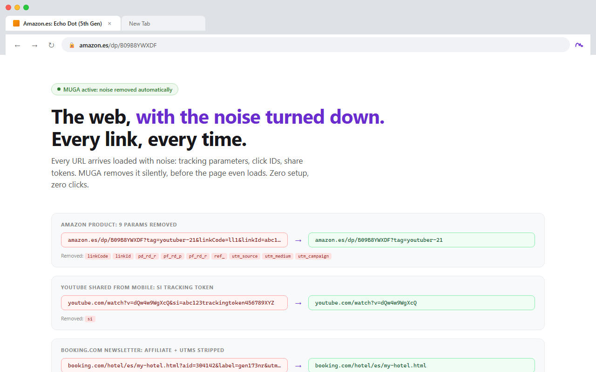
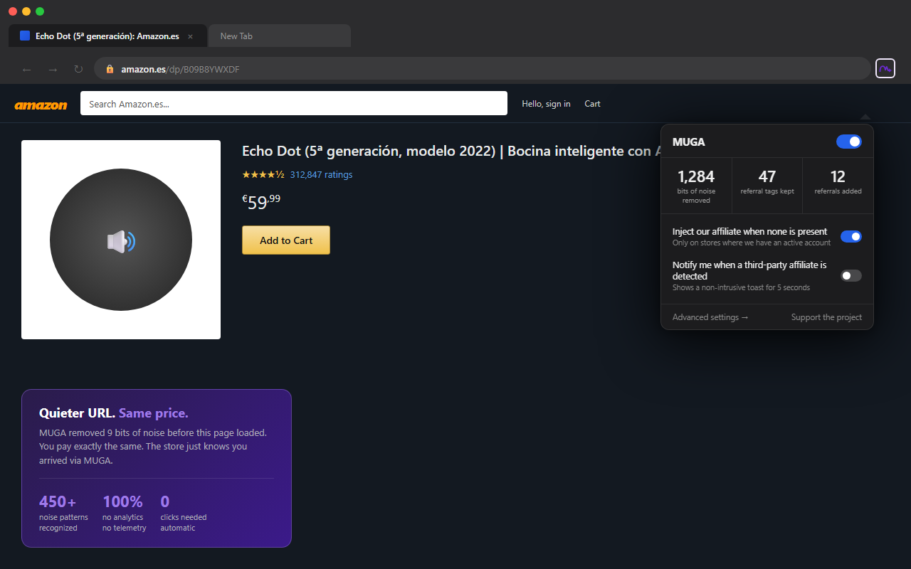
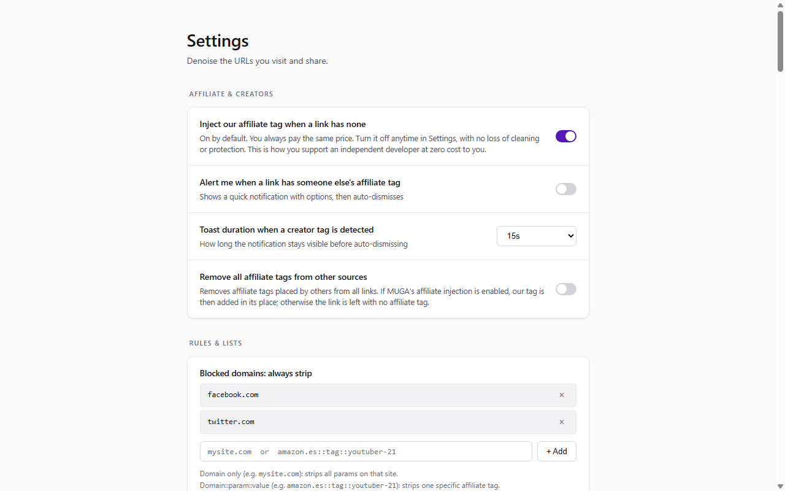

<div align="center">

[](LICENSE)
[](#)
[](#development)
[](CONFORMANCE.md)
# MUGA: URL Cleaner. Remove tracking

### Install now

[](https://addons.mozilla.org/firefox/addon/muga/)
[](https://chromewebstore.google.com/detail/pjdpeamhcjdhfijpmgamjdoplbnbajoh)

---

**MUGA removes the tracking from every URL while trying not to strip the credit of whoever recommended you.** Every other URL cleaner removes `utm_source`, `fbclid`, `gclid`, and the rest. So does MUGA. But every other URL cleaner also strips the affiliate tag of the YouTuber whose video you came from, the newsletter that shared the link, the reviewer who took the time to write the comparison. That tag is how independent creators get paid for the recommendation. By default MUGA tries to leave it alone, and when it does, the popup shows a "Creator referral preserved" badge so you can see it. It is best-effort rather than a guarantee, and you stay in control. No other URL cleaner we know of even attempts this.

> **MUGA?** Maximally Unannoying Garbage Auditor. **MUGA.** Make URLs Quiet Again. **MUGA!** Clean URLs, tracking removed.

> **3.0.0 shipped.** `Referer` suppression and `<a ping>` beacon blocking are enforced at the network layer, and short-link resolution is split so that resolving on click stays on while resolving on hover is opt-in. Presigned download links (GitHub artifacts, S3, Azure) are left untouched instead of broken. See [CHANGELOG](CHANGELOG.md) for the full release notes.

[Privacy policy](https://rules.muga.app/privacy-page.html) · [FAQ](docs/faq.md) · [Changelog](CHANGELOG.md) · [Contributing](CONTRIBUTING.md) · [ADRs](docs/adr/) · [Maintainer ops docs](docs/ops/README.md)

</div>

---

## How it works



MUGA intercepts URLs as you browse and removes the tracking before the page loads. The result is a shorter, cleaner URL: your browsing stays the same, minus the surveillance.

<details>
<summary><strong>More examples</strong></summary>

**E-commerce**: link from a video review
```
Before: https://www.amazon.es/dp/B08N5WRWNW?utm_source=google&gclid=EAIaIQ...&linkCode=ll1&pd_rd_r=xyz&pf_rd_p=def&ref_=nav

After:  https://www.amazon.es/dp/B08N5WRWNW
```

**Video**: shared from mobile
```
Before: https://www.youtube.com/watch?v=dQw4w9WgXcQ&si=abc123trackingtoken456789

After:  https://www.youtube.com/watch?v=dQw4w9WgXcQ
```

**Marketplace**: from a newsletter
```
Before: https://www.ebay.es/itm/123456789?mkevt=1&mkcid=1&mkrid=1185-53479-19255-0&campid=5338722076

After:  https://www.ebay.es/itm/123456789
```

</details>

---

## What it removes

**447 tracking params + 12 prefix patterns** across 6 categories, on every site:

| Category | Examples |
|---|---|
| UTM / Campaign | `utm_source`, `utm_medium`, `utm_campaign` + 6 more |
| Paid Ads | `fbclid`, `gclid`, `msclkid`, `ttclid`, `li_fat_id` + 30 more |
| Email Marketing | `mc_cid`, `_hsenc`, `mkt_tok`, `_mkto_trk`, `_kx` + 20 more |
| Social Media | `igshid`, `igsh`, `epik`, `sc_channel`, `pin_unauth` + 5 more |
| Platform tracking | E-commerce session IDs, click params, marketplace tokens + 25 more |
| Generic | `s_cid`, `wickedid`, and catch-all click IDs |

Domain-specific rules for **188 domains** preserve functional query params (search queries, pagination, filters) while removing the tracking.

---

## What you see

The popup shows what MUGA cleaned on the current page: which parameters were removed, and what the URL looks like now.



Settings give you full control: affiliate behavior, per-domain rules, blacklists, whitelists, and advanced features. The UI ships in English and Spanish (officially maintained); Portuguese, German, French, Italian, and Japanese are community-contributed and may have gaps that fall back to English.



---

## Features

### Always on, no configuration needed

- Remove 447 tracking params and 12 prefix patterns on every navigation (UTMs, fbclid, gclid, share tokens, click IDs, and more)
- Strip e-commerce path clutter (`/ref=nav_logo`, session IDs after product ID, product slug, locale params)
- Right-click any link → **Copy clean link**
- **Alt+Shift+C**: copy clean URL of current tab to clipboard
- Badge counter showing params stripped on current tab
- Popup with before/after preview for the current page

### Optional, configured during first setup

- **Pre-navigation cleaning**: browser-native DNR rules remove tracking patterns *before* the page loads, covering address-bar navigation, bookmarks, and external apps
- **Block `<a ping>` beacons**: prevents background ping requests on click
- **AMP redirect**: silently redirects AMP pages to the canonical article URL
- **Redirect-wrapper unwrapping**: detects and bypasses intermediary redirect wrappers so you land on the real URL

### Configurable

- Per-domain blacklist: strip everything on a specific site, a single param value (`domain::param::value`), or a param regardless of its value (`domain::param::*`)
- Per-domain disable (`domain::disabled`): opt entire domains out of MUGA
- Whitelist: protect specific creator affiliate tags from detection. Supports `domain::param::value` (one exact value) and `domain::param::*` (any value of that param). A Whitelist match always wins over a Blacklist match for the same parameter
- Custom tracking params: add your own parameter names
- Strip all affiliate parameters (opt-in)
- Strip all third-party affiliate tags (opt-in; off by default, the original referral is respected until you turn this on; MUGA never adds a tag of its own in their place)
- Toast notification when a third-party affiliate is detected (opt-in)
- **Remote rule updates**: weekly signed updates to the tracking-param list from `rules.muga.app`. **On by default**: the signing infrastructure is stable and the fetch is a single Ed25519-signed GET to a public URL at most once every 7 days, with no user data sent (see the [CHANGELOG](CHANGELOG.md) for when this shipped). Disable it any time in Settings.
- Export / Import settings as JSON
- Languages: English and Spanish (officially maintained), Portuguese, German, French, Italian, and Japanese (community-contributed; missing entries fall back to English)

### Two optional toggles

Beyond the default local cleaning, MUGA has two independent switches, **both off by default**:

| Toggle | Default | What it does |
|--------|:---:|---|
| **Honor Creator Mode** | Off | Tries to preserve creator referral chains on trusted social-media and link-shortener redirects, so the creator who recommended you the link keeps the credit. This is best-effort, not a guarantee, and you can override it. Redirect-based affiliate-network referrals pass through untouched by default, independent of this toggle, unless you opt in to "strip all third-party affiliate tags". |
| **Follow shortener redirects** | Off | Resolves the eight generic URL shorteners (`bit.ly`, `t.co`, and the like) so you can see where a short link actually leads. Resolution is native: the extension performs the same HTTP request your browser would, reads the redirect target, and rewrites the URL locally, with no MUGA server involved. Requires granting the eight shortener host permissions from Settings. Affiliate-redirect networks are never resolved this way; they pass through unchanged. |

Both toggle on and off at any time in Settings. Turning off "Follow shortener redirects" does not revoke the host permissions automatically; remove them from your browser's extension manager if you prefer.

---

## Affiliate model

Creators come first. MUGA is an open-source project maintained by real people, and it does not add any affiliate tag of its own. It does not monetize your clicks.

By default, MUGA respects the original referral: if a link already carries a creator's or a third party's affiliate tag on a supported store, MUGA leaves it in place, so they keep their credit. This is the default and needs no setup.

If you prefer, "Strip all third-party affiliate tags" in Settings removes those tags instead, leaving none behind. This is an optional extra, off by default, and MUGA never adds a tag of its own in their place.

On stores where attribution is redirect-based (an external server sets the referral via a 30x redirect), MUGA also strips the affiliate tracking parameters (`awc`, `wt_mc`, `lgw_code`, and others) those networks leave on the landing URL, and unwraps affiliate redirect URLs where possible so you land directly on the store, without changing who gets credit for the referral.

This is explained during onboarding, disclosed in the extension description, documented in the [privacy policy](https://rules.muga.app/privacy-page.html), and verifiable in the source code.

- MUGA does not add any affiliate tag of its own
- By default, it respects the original referral already on a link
- Stripping third-party tags is a separate, deliberate opt-in, and it stays your choice

---

## Privacy

- Every URL is processed **locally in your browser**. You stay in control of what MUGA does.
- No browsing data collected, no analytics, no telemetry
- No account, no sign-in, no cloud
- Minimal permissions: `storage`, `activeTab`, `contextMenus`, `declarativeNetRequestWithHostAccess`, `clipboardWrite`. Nothing else.
- The extension also holds `host_permissions: <all_urls>`, required by `declarativeNetRequestWithHostAccess` to clean URLs on all sites.

---

## Supported stores

MUGA preserves creator affiliate tags on **6 programs**: Amazon, eBay, Vercel, DigitalOcean, Lemon Squeezy, Apple Performance Partners. The full allowlist is documented in [`src/rules/manifest.json`](src/rules/manifest.json); the decision algorithm that governs preservation is in [`docs/rules/decision-algorithm.md`](docs/rules/decision-algorithm.md).

MUGA does not hold an affiliate account of its own on any store and does not add any affiliate tag. It only recognizes and preserves existing referrals placed by creators or third-party networks, per the "Affiliate model" above.

---

## Installation

**Firefox.** [Install from AMO](https://addons.mozilla.org/firefox/addon/muga/)

**Chrome.** [Install from Chrome Web Store](https://chromewebstore.google.com/detail/pjdpeamhcjdhfijpmgamjdoplbnbajoh)

Or install from source:

```bash
git clone https://github.com/yocreoquesi/muga.git
cd muga && npm install
npm run build:chrome   # → dist/chrome/
npm run build:firefox  # → dist/firefox/
```
Load unpacked from `chrome://extensions` (Developer mode) or `about:debugging` in Firefox.

---

## Development

```bash
npm test               # 4,400+ unit tests
npm run test:e2e       # 90+ E2E tests (Playwright, requires headed Chromium)
npm run build:chrome
npm run build:firefox
```

New release: tag `vX.Y.Z` → push → GitHub Actions builds and publishes automatically.

---

## Contributing

PRs welcome for new tracking patterns, new stores, or additional languages. Read [CONTRIBUTING.md](CONTRIBUTING.md) for setup, workflow, and conventions.

Key contribution points:

- **New tracking parameters**: add to `TRACKING_PARAMS` and the appropriate `TRACKING_PARAM_CATEGORIES` group in [`src/lib/affiliates.js`](src/lib/affiliates.js)
- **New stores**: add an entry to `AFFILIATE_PATTERNS` in [`src/lib/affiliates.js`](src/lib/affiliates.js)
- **Domain-specific param preservation**: add a rule to [`src/rules/domain-rules.json`](src/rules/domain-rules.json)
- **Tests**: see [`tests/unit/cleaner.test.mjs`](tests/unit/cleaner.test.mjs)

---

## Support

If MUGA saves you time or annoyance, consider supporting it on [Ko-fi](https://ko-fi.com/yocreoquesi). It helps keep the project going.

---

## License

[GPL v3](LICENSE): forks and derivative works must remain open source under the same license.

This project was relicensed from MIT to GPL v3 on 2026-03-22 by the sole copyright holder. All versions, including prior releases, are retroactively covered under GPL v3.

---

*Built with the assistance of AI agents ([Claude](https://www.anthropic.com/claude) by Anthropic).*
